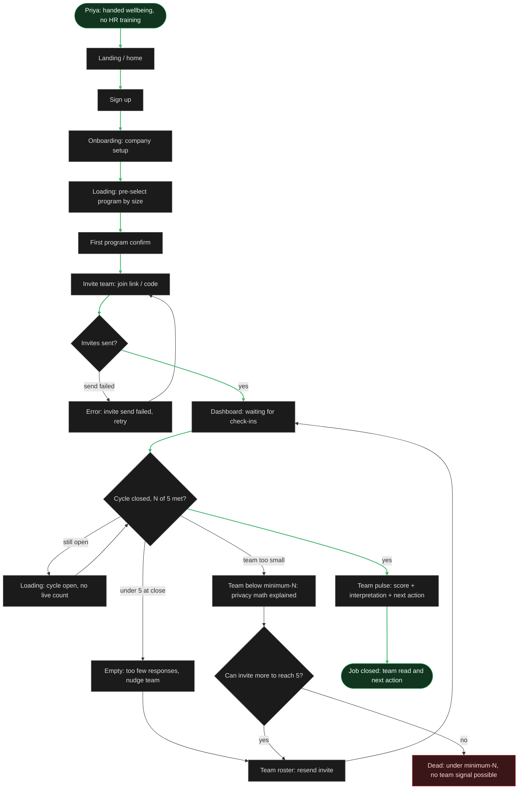
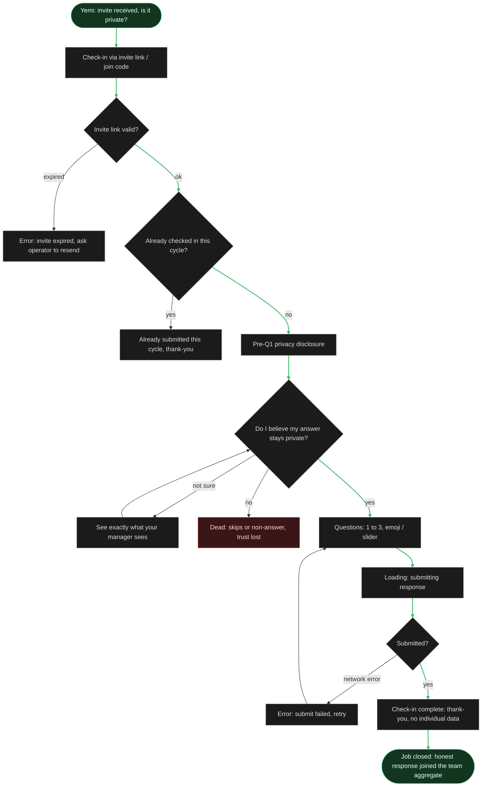
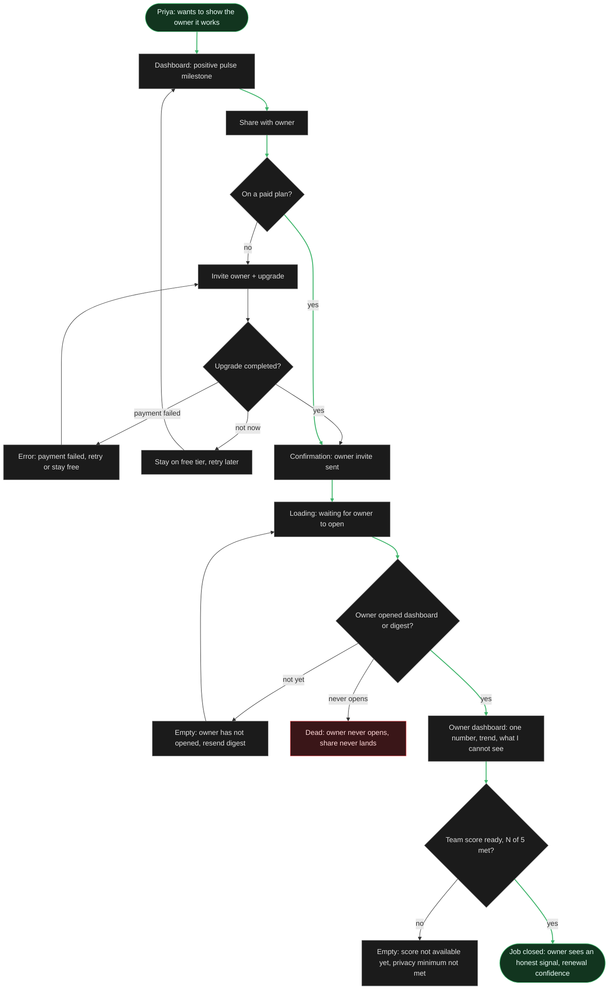
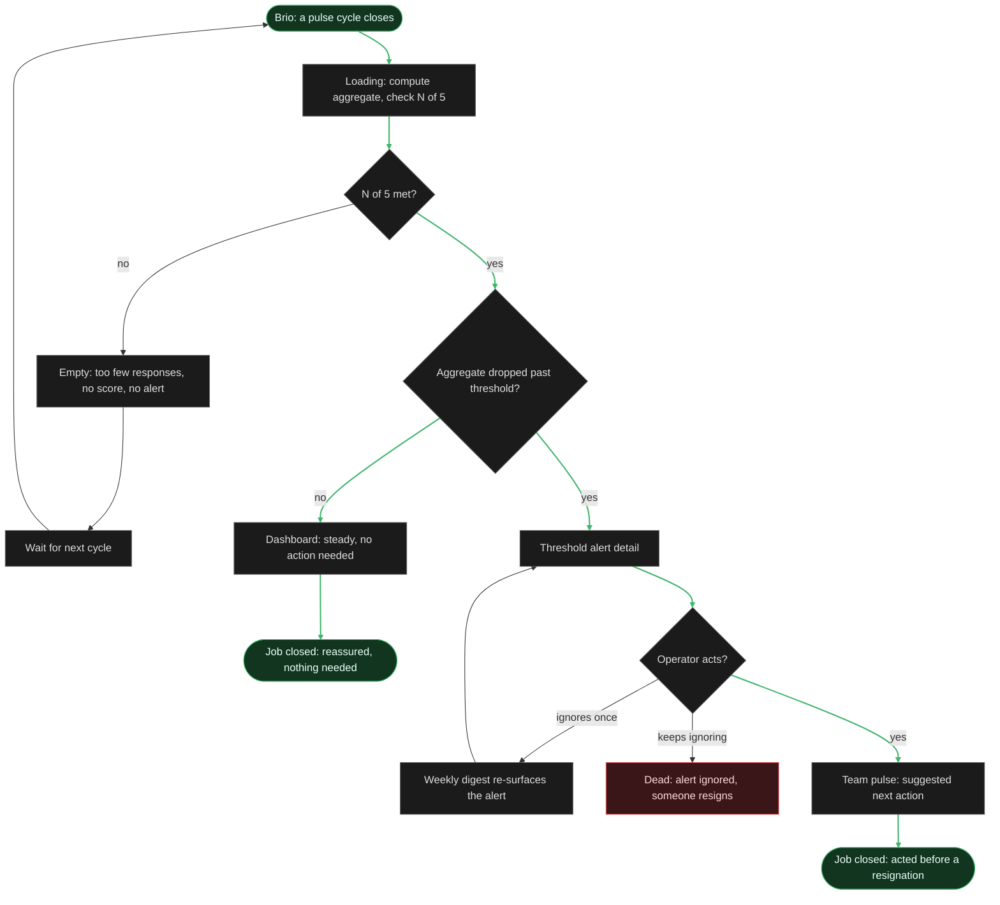

# Information Architecture - Base Layer (User Flows)

*Phase: IA (Basic). User flows for the primary persona's main job plus key related jobs, from user-research/docs/jtbd.md. Each flow proves the route: steps, decision diamonds, states (empty / error / loading), both ends (success and dead-end). Color is semantic, not decorative: green = happy-path ends and the arrows that reach them, red = a true dead-end with no path to the goal, gray = everything between, including an error that recovers. Every node-screen exists in sitemap.md. Colors reuse the project token palette (green #3fb56b, red #e5484d, gray #5a5a5a). Step 6 critique fixes are applied (dead-end exits and missing states added).*

---

## Flow 1 - MAIN JOB (Priya): Run wellbeing without HR training

**Decisions:** invites sent? cycle closed and N of 5 met? can invite more to reach 5? **States:** loading (pre-select program; cycle open with no live count), empty (too few responses at close, nudge), error (invite send failed, retry). **Informed stop (Step 6 DE1):** a team structurally under minimum-N first sees the privacy-math explainer and an offer to invite more; only if it cannot reach 5 is it a dead-end. **Dead-end:** team stays under minimum-N, so an aggregate signal is genuinely not possible (the honest limit of an aggregate-only model; a program-only, no-score mode is a possible future fallback). **Recoverable loop:** under-5-at-close, nudge, resend invite, back to waiting. **Success:** pulse read plus next action.

---

## Flow 2 - J3 + J4 (Yemi): Private, under-30s check-in

**Decisions:** invite valid? already checked in this cycle? do I believe it stays private? submitted? **States:** error (expired invite, recovers via operator resend; submit failed, retry), loading (submitting), already-submitted (Step 6 MS1: re-open after completing shows a thank-you, not a duplicate). **Recovery (Step 6 DE2):** an unsure employee can open "see exactly what your manager sees" and return to the decision, instead of being lost immediately. **Dead-end:** disbelief in privacy, she skips or non-answers, trust lost (the E4 mental opt-out; red because there is no in-flow path back to an honest answer once trust is gone). **Success:** honest response joins the aggregate.

---

## Flow 3 - J1 + J5 + S2 (Priya to Marcus): Prove it works, owner share and upgrade

**Decisions:** on a paid plan? upgrade completed? owner opened it? team score ready (N of 5)? **States:** error (payment failed, retry or stay free), loading (waiting for owner), empty (owner has not opened, resend digest; and Step 6 MS2: owner opens before the minimum-N is met, so the score is not shown yet). **Recoverable exit (Step 6 DE3):** declining the upgrade is not a trap, she stays on the free tier and can retry later. **Dead-end:** owner never opens despite resends, the share never lands (the operator cannot force the owner to look). **Success:** owner reads an honest signal. The highlighted spine is the already-paid path; the upgrade branch (Upgrade, Pay, Sent) also converges to success.

---

## Flow 4 - J2 (Priya): Know if the team is struggling early

**Decisions:** N of 5 met? dropped past threshold? operator acts? **States:** loading (compute aggregate), empty (too few responses, no score, no alert). **Escalation (Step 6 DE4):** a single ignore does not equal a resignation, the weekly digest re-surfaces the alert; only repeated ignoring is the dead-end. **Two success ends** (both close J2): steady equals reassured, and alert-then-acted. **Dead-end:** alert kept ignored, someone resigns (the early-warning miss).

---

## Legend

- **Green** (success): the start and finish of a happy path (job closed), plus the arrows that reach it. Intermediate screens stay neutral.
- **Red** (dead): a true dead-end, a node with no path to the goal (team under minimum-N, trust lost, owner never opens, alert kept ignored).
- **Gray** (neutral): everything between the ends, including decision diamonds, loading / empty / already-submitted, recovery detours, and an error that recovers with an arrow back toward the goal.
